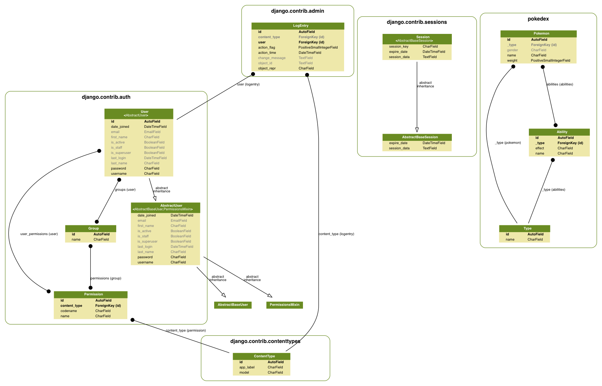

# Django Pokedex

This is a django-based Pokedex API.

## Setup

**Requirements**

 - python 2.6 +
 - [pip](https://pip.pypa.io/en/stable/installing/)
 - [virtualenvwrapper](http://virtualenvwrapper.readthedocs.io/en/latest/install.html)
 - postgres

**Instructions**

. Clone repo

    git clone git@github.com:InclusionOrg/django-pokedex.git
    cd django-pokedex

. Make virtual enviroment

    mkvirtualenv django-pokedex

. Install dependencies

    pip install -r requirements.txt

. Create Database `project_001`

. Run migrations

    ./manage.py migrate

. Run Server

    ./manage.py runserver

The project will be up at `localhost:8000`

**Postres DB on OS X**
The easies way to use Postres on OS X is with the [Postgres.app](http://postgresapp.com/)

Once you have postgres up and running, drop into the postgres shell to create a table.

    $ psql

    psql (9.X.X)
    Type "help" for help.

    username=# CREATE DATABASE project_001;

Then run migrations (`./manage.py migrate`)

## Pokedex

